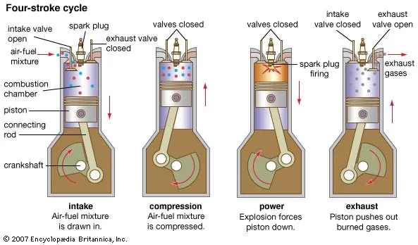

<h1 align="center">
 Interesting information about automobiles/vehicles
</h1>
The website is about automobiles/vehicles

  <strong> Engines </strong>

 
Engines are the reason you are able to move a 4000 pound metal box from one place to another
 
But, did you know that there are mainly <strong> two different types of engines </strong>
 

Simple, an IC Engine is where the combustion happens withing the piston itself (Used in our modern vehicles)
 

