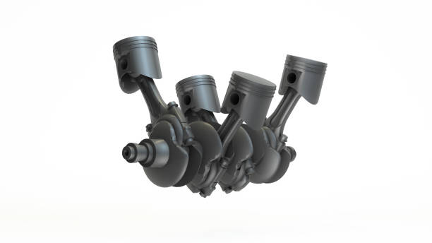
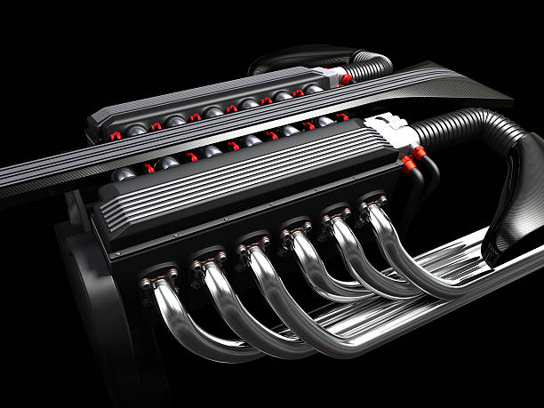

<h1 align="center">
 Interesting information about automobiles/vehicles
</h1>
The website is about automobiles/vehicles
<strong> This is a simplified explanation of all the components of a car. </strong>

<h1>  <strong> Engines </strong> </h1>

 
Engines are the reason you are able to move a 4000 pound metal box from one place to another
 
But, did you know that there are mainly <strong> two different types of engines </strong>
 

Simple, an IC Engine is where the combustion happens withing the piston itself (Used in our modern vehicles)
 

On the other hand, the Internal Combustion Engine has the combustion, that drives the vehicle, outside the piston.
 
<h4> Within these Engines, there are other factors that can affect the amount of power generated, such as: Piston Congiurations, # of pistons, etc. </h4>
The average car has 4 pistons working simultaneously in an Engine
However, there are cars that have a higher number of pistons, that can deliver more horsepower compared to the latter.

This is your typical engine with 4 pistons

This engine has 12 pistons that work simultaneously to move the vehicle
 
 
<h1> Fuel System</h1>
In a car, you will find that the fuel tank connects to the Engine through a fuel rail
These rails are made to help inject a specfic amount of fuel into the cylinders of the Engine (to create the combustion to drive the car).
To have a pictorial representation of the fuel systme in a car visit:
[Fuel System]([https://www.genome.gov/)](https://www.cars.com/auto-repair/glossary/fuel-system/#:~:text=A%20vehicle's%20fuel%20system%20comprises,require%20replacement%20on%20a%20schedule.)
