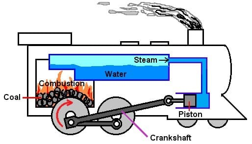
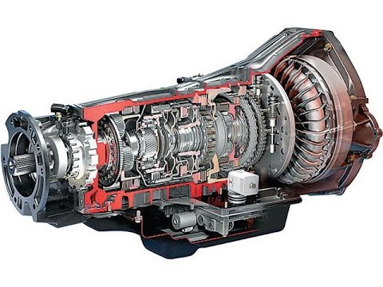

<h1 align="center">
 Interesting information about automobiles/vehicles (and how the main components of the car are able to move this piece of metal)
</h1>
The website is about automobiles/vehicles
<strong> This is a simplified explanation of all the components of a car. </strong>

<h1>  <strong> Engines </strong> </h1>

 
Engines are the reason you are able to move a 4000 pound metal box from one place to another
 
But, did you know that there are mainly <strong> two different types of engines </strong>
 

Simple, an IC Engine is where the combustion happens withing the piston itself (Used in our modern vehicles)
 

On the other hand, the Internal Combustion Engine has the combustion, that drives the vehicle, outside the piston.
 
<h4> Within these Engines, there are other factors that can affect the amount of power generated, such as: Piston Congiurations, # of pistons, etc. </h4>
The average car has 4 pistons working simultaneously in an Engine
However, there are cars that have a higher number of pistons, that can deliver more horsepower compared to the latter.

This is your typical engine with 4 pistons

This engine has 12 pistons that work simultaneously to move the vehicle
 
 
<h1> Fuel System</h1>
In a car, you will find that the fuel tank connects to the Engine through a fuel rail
These rails are made to help inject a specfic amount of fuel into the cylinders of the Engine (to create the combustion to drive the car).
To have a pictorial representation of the fuel systme in a car visit:
[Fuel System](https://www.cars.com/auto-repair/glossary/fuel-system/#:~:text=A%20vehicle's%20fuel%20system%20comprises,require%20replacement%20on%20a%20schedule.)]
 
<h1> Transmission System </h1>
The Transmission system's main purpose is to deliver the energy form the engine to the driveshaft (which delivers the energy to the wheels).

[Transmission System](https://www.moogparts.com/parts-matter/failing-driveshaft.html)]
<storng> The transmission currently is much more sophisticated and better than the type that is going to be explained </strong>
At the heart of it, the transmission is a system of gears that deliver power to the Drive Shaft form the Engine Shaft through the countershaft. 
The system of gears are required to limit the rpm/torque of the drive shaft. 
First of all, when your car is in neutral gear, power is transmitted to the Countershaft, but is connected to the Drive Shaft with a freely rotating gear (which cannot move the Drive Shaft)
Then, to swith to another gear, a clutch that is perpendicular to the rotation of the Engine and the drive shaftcan move between the Gap between them. as the clutch moves, it meshes in and out of other gears from the countershaft. Using the gear ratio of the gear on the clutch to the gear on the countershaft (which is powered through the Engine Shaft), you are able to change the torque and rpm of the Drive Shaft.
 
A general rule of thumb is that in a low gear, the torque is high and the rpm possible is low. On the other hand, in a high gear, the torque is low and the rpm possible is higher than the lower gears.
